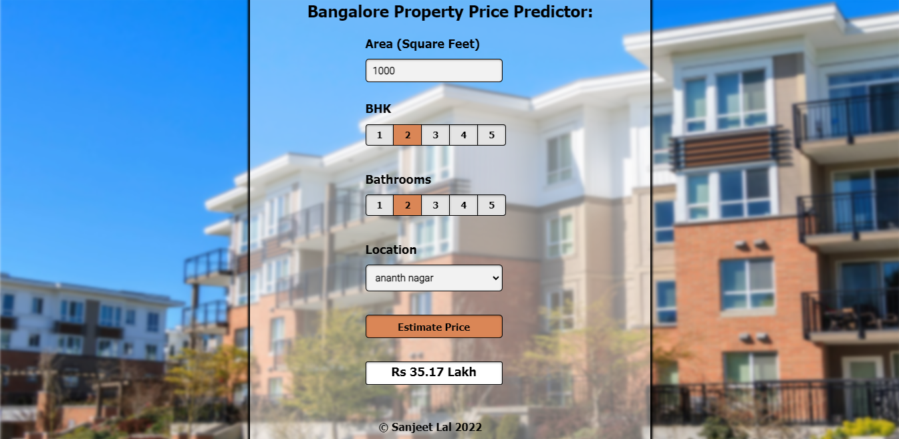

# Bangalore-price-pred-SanjeetLal
<b>Overview :-</b>A simple end to end machine learning project for predicting property prices in the city of Bangalore. 
<b>Technical details :-</b>A webpage containing a basic ui based on a flask server which takes in a model which is trained on a Bengaluru house price dataset using a Linear Regression model, for predicting the approximate price of a property based on the user inputted values.
 <b>Link to this site</b> :-<a target="_blank">https://bangalore-property-prediction.herokuapp.com/</a> 
<b>Sample screenshot :-</b> 
</img>
